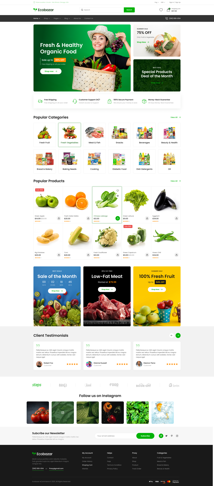
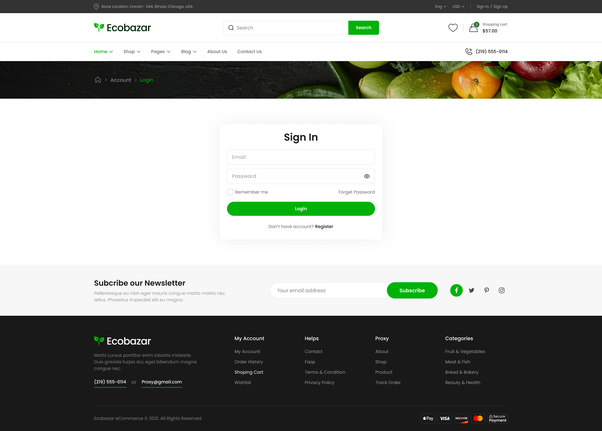
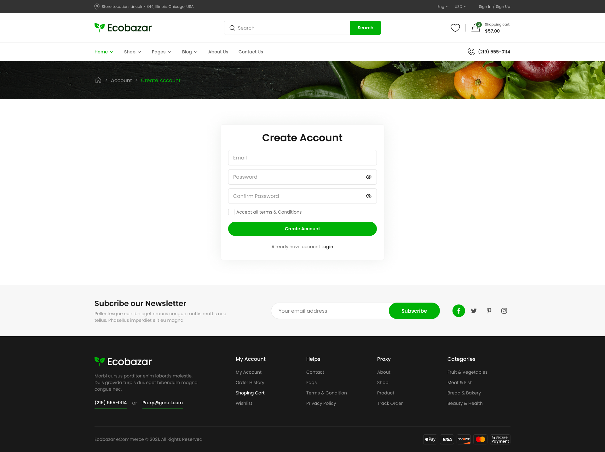
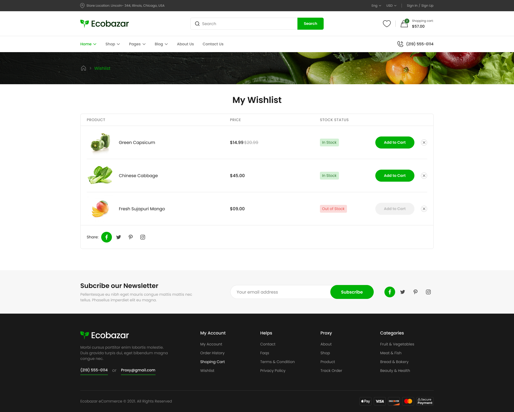
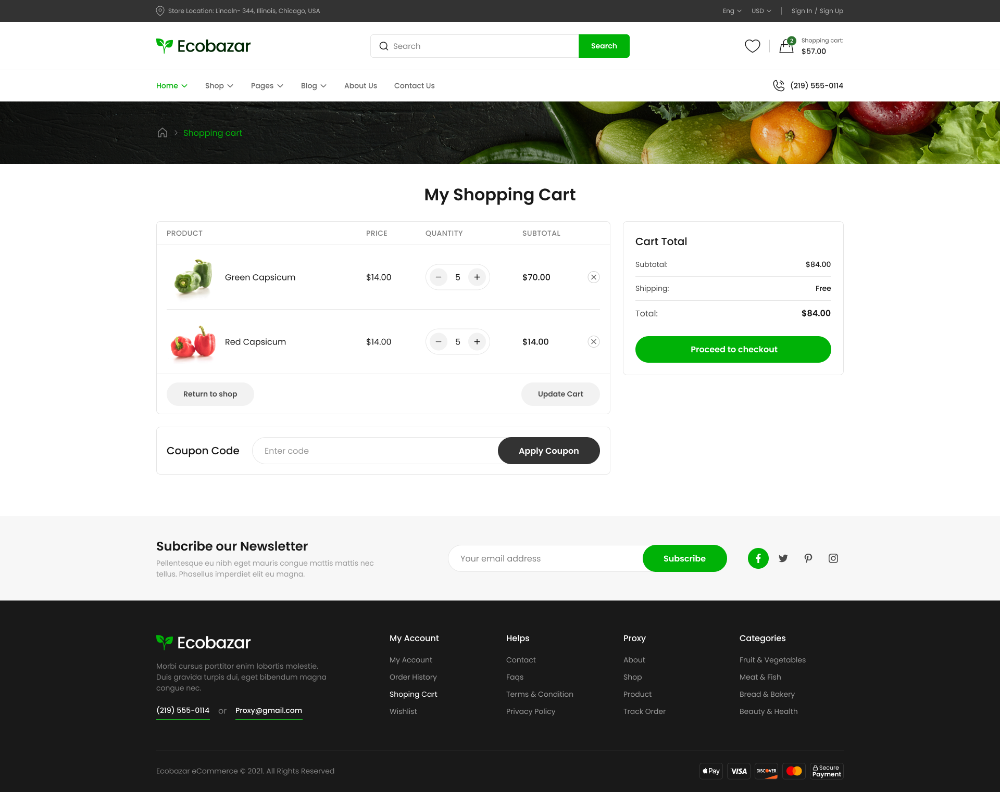
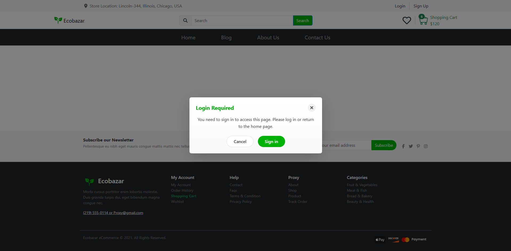
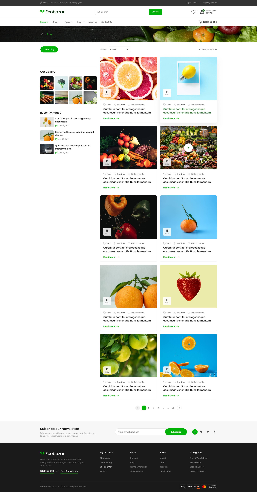
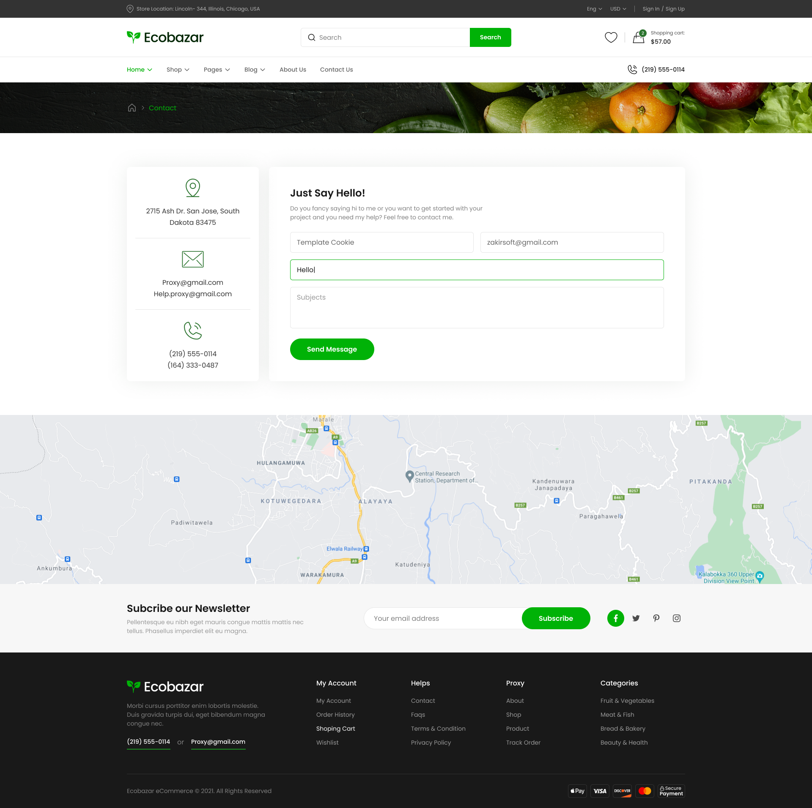
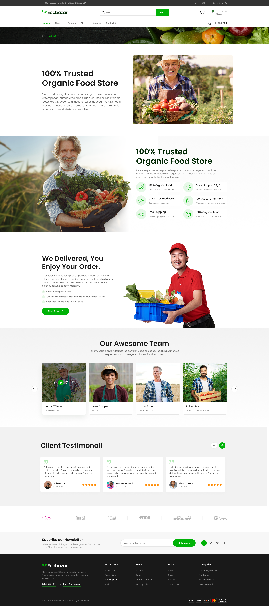
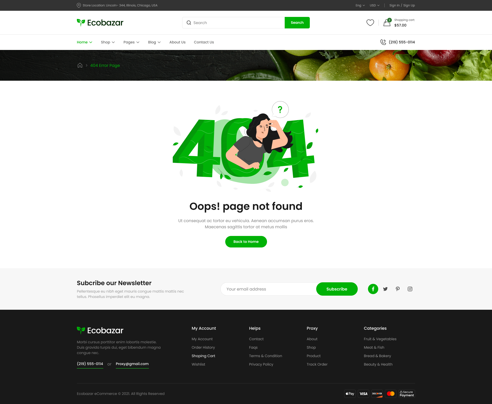

# 🛍️ Shopery – Organic eCommerce Website

A modern and responsive **React eCommerce web application**  
It allows users to browse organic products, add them to cart or wishlist, and register or log in to shop securely.

---

## 🚀 Features

### 🔐 Authentication System
- Built using **Formik** and **Yup** for form handling and validation.  
- Prevents duplicate accounts by checking if the email already exists before signup.  
- Displays a **personalized welcome message** after successful login.  
- Uses **JSON Server** as a mock backend to store users’ data.  
---
### 🧭 Protected Routing
- Implemented with **React Router v7**.  
- Only authenticated users can access the **Cart** and **Wishlist** pages.  
- Redirects unauthenticated users to the **Login** page automatically.
---
### 🛒 Cart & Wishlist
- Managed using **React Hooks** for dynamic state updates.  
- Items can be added or removed instantly.  
- Quantity and total prices update in real time.  
- Data is stored locally for session persistence.
---
### 💄 UI / UX
- Based on the Figma design for a clean, modern shopping experience.  
- Responsive layout with **React Bootstrap** and **Bootstrap 5**.  
- Icons from **React Icons** and **FontAwesome**.  
- Smooth loading animations via **React Loader Spinner**.
---
### 🌐 API & Data
- **Axios** handles all HTTP requests (GET, POST, DELETE).  
- Backend simulation via **JSON Server** (`server/db.json`).  
- Easy to test and modify locally.

---

## 🧠 Tech Stack

| Category | Tools / Libraries |
|-----------|-------------------|
| **Frontend** | React 19.1.1, Vite |
| **Styling** | Bootstrap 5, React Bootstrap |
| **Routing** | React Router DOM 7.9.3 |
| **Forms & Validation** | Formik, Yup |
| **API Requests** | Axios |
| **Icons** | FontAwesome, React Icons |
| **Mock Backend** | JSON Server |
| **Utilities** | React Hooks, Prettier, ESLint |

---
## Screenshots

### 🏠 Home Page


---

### 🔑 Login Page


---

### 📝 Sign Up Page


---

### ❤️ Wishlist Page


---

### 🛒 Cart Page


---

### 🔐 Protected Routing


---

### 📰 Blog Page


---

### 📬 Contact Us Page


---

### 👤 About Page


---

### ⚠️ Error Page



---

## ⚙️ Installation & Setup

1. **Clone the repository**
   bash
   git clone https://github.com/yourusername/shopery.git
   cd shopery


2. **Install dependencies**

   bash
   npm install
   

3. **Start the development server**

   bash
   npm run dev
 

4. **Start the mock backend**

  bash
   npm run server
   # or
   json-server --watch server/db.json --port 5000


5. **Open in your browser**

   http://localhost:5173


---

## 📂 Project Structure

```SHOPERY/
├── node_modules/
├── public/
├── screenshots/ # All project preview images
│ ├── homepage.png
│ ├── sign-in.png
│ ├── sign-up.png
│ ├── Wishlist.png
│ ├── shopping_cart.png
│ ├── protected-routing.png
│ ├── blog_list.png
│ ├── contact-us.png
│ ├── about.png
│ └── error-page.png
├── server/
│ └── db.json # JSON Server mock data
├── src/
│ ├── Api/ # Axios configuration or API calls
│ ├── assets/ # Images, icons, etc.
│ ├── Components/ # Reusable UI components
│ │ ├── Banner/
│ │ ├── Deals/
│ │ ├── Features/
│ │ ├── Footer/
│ │ ├── Header/
│ │ ├── Instagram/
│ │ └── Vector/
│ ├── Context/ # React Context for global states
│ │ ├── ShopContext.js
│ │ ├── ShopProvider.jsx
│ │ ├── UserContext.js
│ │ └── UserProvider.jsx
│ ├── Layout/ # Layout components (Main & Shared)
│ │ ├── Mainlayout.jsx
│ │ └── Sharelayout.jsx
│ ├── Pages/ # Application pages
│ ├── ProtectedRoute/ # Route protection logic
│ │ └── ProtectedRoute.jsx
│ ├── Styles/ # CSS or SCSS files
│ ├── main.jsx # React entry point
│ └── index.css
├── .gitignore
├── eslint.config.js
├── index.html
├── package.json
├── package-lock.json
├── README.md
├── TestComponent.jsx
└── vite.config.js
```
---

## 🧾 Example Mock Data (`server/db.json`)

```json
{
  "users": [
    { "id": 1, "name": "Marwa", "email": "marwa@gmail.com", "password": "123456" }
  ],
  "products": [
    { "id": 1, "name": "Organic Apple", "price": 25, "image": "/images/apple.png" }
  ],
  "cart": [],
  "wishlist": []
}
```
 ---


## 💡 Future Enhancements

* Integrate real backend (Firebase or Node.js).
* Add advanced filters & search.
* Checkout & payment gateway integration.
* User profile and order history.
* Dark mode toggle 🌙.

---

## 👩‍💻 Author

**Marwa Elgorn**
Front-End Developer | React Enthusiast
💼 [LinkedIn](https://www.linkedin.com/in/marwa-elgorn/) • 🐙 [GitHub](https://github.com/MarwaElgorn)


